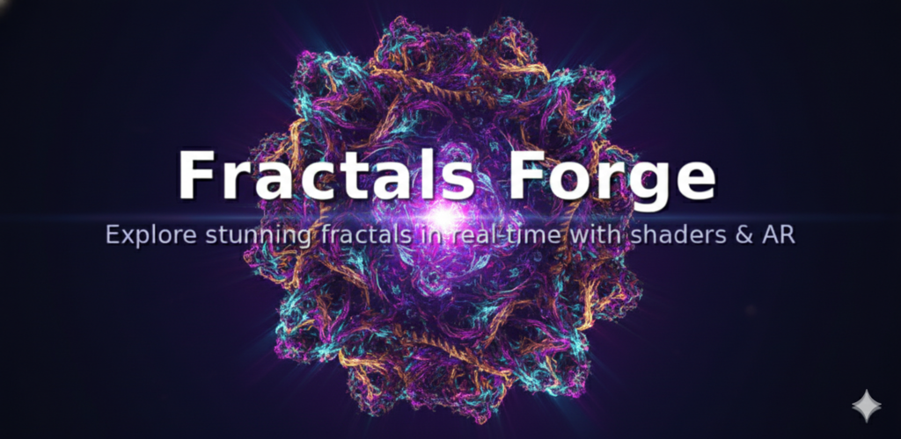
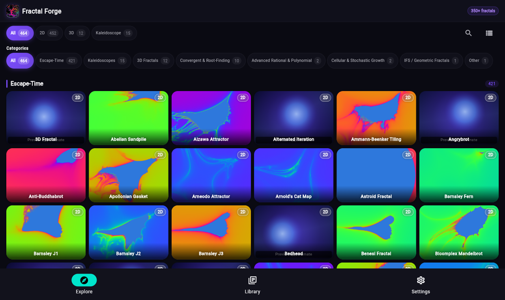
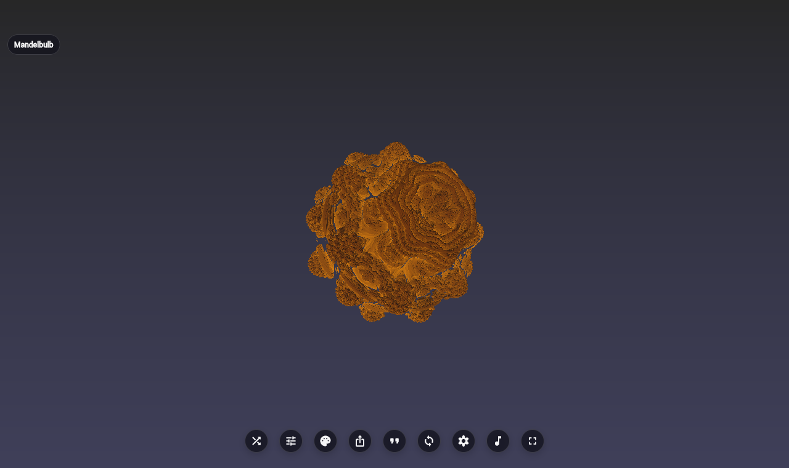

# Flutter Fractal Forge 🌀

<p align="center">
  
</p>


[](https://flutter.dev)
[](https://dart.dev)
[](LICENSE)

**Fractal Forge** is an open-source Flutter fractal explorer focused on GPU-first shader rendering, deep zoom, and a broad catalog of mathematical systems.

## Try it

- **Web:** [fractal.trebuchetdynamics.com](https://fractal.trebuchetdynamics.com)
- **Android:** [Google Play Store](https://play.google.com/store/apps/details?id=com.trebuchetdynamics.fractal.forge)

> The installable app is the primary experience. The browser build targets WebGL 2.0; WebAssembly is not currently supported. See [`docs/planning/LAUNCH_LADDER.md`](docs/planning/LAUNCH_LADDER.md) and [`docs/engineering/rendering/renderer_backend_matrix.md`](docs/engineering/rendering/renderer_backend_matrix.md).

---

## ✨ Features

### 🔢 350+ Fractal Types Across 15+ Categories

**Escape-time fractals**
Mandelbrot, Julia sets, Burning Ship, Tricorn, Celtic, Buffalo, Newton basins, Nova, Phoenix, Lyapunov, Buddhabrot variants, and dozens more.

**Strange attractors**
Clifford, Peter de Jong, Lorenz, Rossler, and related continuous/discrete attractor families.

**Cellular automata**
Wolfram Rule 30, Langton's Ant, Game of Life variants, and related 2D rule systems.

**Space-filling curves**
Hilbert, Peano, Gosper, Moore, and related recursive curve families.

**IFS fractals**
Sierpinski triangle and carpet, Koch snowflake, Barnsley Fern, and other iterated function systems.

**Aperiodic tilings**
Penrose (P2/P3), Hat monotile, Ammann-Beenker, and related non-periodic plane tilings.

**Root-finding fractals**
Newton, Halley, Householder, Schroeder, and other numerical method basins of attraction.

**3D ray-marched fractals**
Mandelbulb, Mandelbox, pseudo-Kleinian, and other distance-estimated 3D structures — rendered in real time by GLSL fragment shaders on the GPU.

Fractal Forge is GPU-first: the interactive catalog uses GLSL fragment shaders where the platform supports them, with documented CPU Precision paths for deep-zoom cases that need stable refinement.


### 🔬 Deep Zoom — Precision Ladder

A three-tier precision ladder routes supported modules through the most honest available render path:

| Tier | Method | Intended use |
| :--- | :--- | :--- |
| 1 | float32 GPU | Standard interactive zoom |
| 2 | Extended GPU preview | Double-float or perturbation preview for deeper interactive zoom |
| 3 | CPU Precision | Stable refinement path for supported deep-zoom 2D modules |

The installable app is the primary experience. Browser support is a WebGL 2.0 preview; export/share, CPU precision fallback, and deep-zoom browser behavior are tracked in the renderer backend matrix.

### 🎨 60+ Colour Schemes with sRGB-Correct Rendering

Rendering techniques available across fractal types:
- Smooth colouring (continuous iteration count)
- Orbit traps
- Distance estimation
- Stripe averaging
- Triangle inequality averaging
- Curvature averaging
- Normal-map bas-relief shading

All colour output is sRGB-correct with proper gamma for accurate reproduction on modern displays.

### 🪞 Dual Mandelbrot / Julia Viewer

See the Mandelbrot set and its corresponding Julia set side by side. Tap any point in the Mandelbrot half to instantly update the Julia seed parameter.

### 🤖 Auto-Explore Mode

Let the app discover interesting regions automatically. The intelligent zoom navigation finds mathematically rich structures in any fractal without manual input.

### 💾 50+ Built-in Presets

Jump straight to famous regions — Seahorse Valley, Elephant Valley, deep spiral arms, Julia islands, and more — with a single tap.

### ♿ WCAG AAA Accessibility

- High-contrast theme
- Reduced-motion support
- Screen reader labels on all interactive elements
- Configurable touch targets

### 📤 Export

Save fractals as high-resolution PNGs with optional transparency and share directly from the installable app. Browser export/share behavior is preview-grade until validated in the web launch checklist.

### 🔒 No Ads. No Tracking. No Data Collection.


---

## 📸 Screenshots

Representative catalog and viewer captures:

| Catalog exploration | GPU viewer |
| :---: | :---: |
|  |  |

---

## 🚀 Getting Started

### Prerequisites

- **Flutter SDK** >= 3.0.0
- **Dart SDK** >= 3.0.0
- A device/emulator with OpenGL ES 3.0+ support (required for GPU shaders)

### Installation

1. **Clone the repository:**

   ```bash
   git clone https://github.com/TrebuchetDynamics/flutter-fractal-forge.git
   cd flutter-fractal-forge
   ```

2. **Install dependencies:**

   ```bash
   flutter pub get
   ```

3. **Run the app:**

   ```bash
   flutter run
   ```

### Platform-Specific Build

#### Android

```bash
flutter build apk --release
# or for a local app bundle
flutter build appbundle --release
```

Release signing files are intentionally not tracked. For Google Play upload builds:

1. Copy `android/key.properties.example` to `android/key.properties`.
2. Point `storeFile` to your private upload keystore, preferably outside the repo.
3. Never commit `android/key.properties`, `*.jks`, `*.keystore`, `*.p12`, `*.pfx`, or `*.pem` files.
4. Build the Play Console artifact with:

   ```bash
   scripts/build-play-console.sh
   ```

#### iOS

```bash
flutter build ios --release
```

#### Linux / macOS / Windows

```bash
flutter build linux --release
flutter build macos --release
flutter build windows --release
```

> **Note:** Desktop platforms may have limited shader support depending on GPU drivers.

---

## 🏗️ Architecture

```text
lib/
├── core/                               # Core business logic
│   ├── models/                         # Data models
│   │   ├── fractal_params.dart         # Legacy parameter model
│   │   ├── fractal_parameter.dart      # Parameter schema definition
│   │   ├── fractal_preset.dart         # Preset storage model
│   │   ├── fractal_view_state.dart     # Camera/view state
│   │   └── export_options.dart         # Export configuration
│   ├── modules/                        # Fractal module definitions
│   │   ├── fractal_module.dart         # Base module interface
│   │   ├── module_registry.dart        # Central module registry
│   │   └── [350+ module files]         # One file per fractal type
│   ├── services/                       # App-wide services
│   │   ├── accessibility_service.dart  # WCAG AAA helpers
│   │   └── palette_service.dart        # 60+ colour scheme management
│   └── theme/                          # Theming system
│       └── app_theme.dart
├── features/                           # Feature modules
│   ├── auto_explore/                   # Intelligent auto-zoom
│   ├── catalog/                        # Fractal catalog browser
│   ├── controls/                       # Parameter controls UI
│   ├── debug/                          # Debug overlay (dev only)
│   ├── export/                         # PNG export & batch export
│   ├── history/                        # Navigation history
│   ├── home/                           # Home screen
│   ├── onboarding/                     # First-run onboarding
│   ├── presets/                        # Preset management
│   ├── renderer/                       # Shader rendering engine
│   │   ├── fractal_renderer.dart       # Main renderer widget
│   │   ├── fractal_painter.dart        # CustomPainter for shaders
│   │   └── cpu_fractal_renderer.dart   # CPU double-precision fallback
│   ├── settings/                       # Accessibility settings
│   ├── viewer/                         # Full-screen fractal viewer
│   │   ├── fractal_viewer_screen.dart  # Main viewer screen
│   │   └── components/                 # Viewer sub-components
│   └── wallpaper/                      # Wallpaper export
├── l10n/                               # Localisation (en, es)
└── main.dart                           # App entry point
```

### Key Components

**FractalModule** — Defines a fractal type with its GLSL shader, parameter schema, and built-in presets. Each module is self-contained and declarative. The `ModuleRegistry` holds all 350+ modules.

**FractalRenderer** — Stateful widget that loads the appropriate GLSL fragment shader, handles gesture input (pan, pinch, double-tap), and renders at up to 60 FPS using `CustomPainter`.

**Multi-precision zoom engine** — Automatically selects float32 GPU, double-float GPU emulation, or CPU double fallback based on the current zoom depth.

**PaletteService** — Manages the 60+ colour schemes and applies sRGB-correct gamma to all output.

**AccessibilityService** — Enforces WCAG AAA contrast ratios, respects `prefers-reduced-motion`, and surfaces screen reader semantics throughout the widget tree.

---

## 🎮 Controls

### Gesture Controls

| Gesture | 2D Fractals | 3D Fractals |
| :--- | :--- | :--- |
| **Drag** | Pan view | Rotate view |
| **Pinch** | Zoom in/out | Zoom in/out |
| **Double Tap** | Reset view | Reset view |
| **Long Press** | Set Julia seed (dual viewer) | — |

### Parameter Controls

- **Iterations** — Detail level (higher = more detail, slower render)
- **Bailout** — Escape threshold for calculations
- **Power** — Mathematical power exponent (3D fractals)
- **Colour Scheme** — Select from 60+ palettes
- **Rendering technique** — Orbit trap, distance estimation, stripe averaging, etc.

---

## 🧪 Testing

```bash
# Unit and widget tests
flutter test

# Integration tests (requires device/emulator)
flutter test integration_test

# With coverage
flutter test --coverage
```

---

## 🔧 Shader Development

Shaders are located in `/shaders/` and use GLSL fragment shader syntax compatible with Flutter's `FragmentProgram` API:

```glsl
// Example: shaders/mandelbrot.frag
#version 320 es
precision highp float;

uniform float uTime;
uniform vec2 uResolution;
uniform vec2 uCenter;
uniform float uZoom;
// ... more uniforms

out vec4 fragColor;

void main() {
    // Escape-time calculation with smooth colouring
}
```

---

## 📋 Requirements

| Platform | Minimum | Notes |
| :------- | :------ | :---- |
| iOS      | 10.0 | Metal-backed shaders |
| Web      | Chrome 70+ | WebGL 2.0 required |
| Desktop  | Varies | GPU driver dependent |

---

## 📊 Performance

- **Target:** 60 FPS on mid-range devices
- **Adaptive quality:** Reduces iteration count on lower-end GPUs
- **GPU acceleration:** All rendering via GLSL fragment shaders
- **Memory efficient:** No large texture allocations
- **Precision tiers:** Automatic fallback preserves correctness at extreme zoom
- **Renderer docs:** `docs/engineering/rendering/cpu_vs_gpu_rendering.md`, `docs/engineering/rendering/renderer_backend_matrix.md`, `docs/engineering/rendering/formula_coverage_limitation.md`

---

## 🌐 Localisation

English and Spanish language support via Flutter's `gen-l10n` pipeline. All strings are in `lib/l10n/app_en.arb` and `lib/l10n/app_es.arb`.

---

## 🤝 Contributing

Contributions are welcome. Please read the [Contributing Guide](CONTRIBUTING.md) for details on code style, pull request process, and issue reporting.

---

## 📄 License

MIT License — see the [LICENSE](LICENSE) file for details.

---

## 🙏 Acknowledgments

- [Flutter Team](https://flutter.dev) — Cross-platform framework
- [Inigo Quilez](https://iquilezles.org/) — Shader techniques, distance estimation, and raymarching methods
- The fractal mathematics community for algorithmic foundations
- Shader art communities for visual inspiration

---

<p align="center">
  Made with ❤️ and Flutter
</p>
