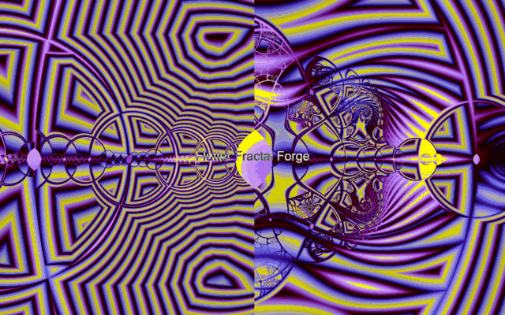

# Fractal Forge

<p align="center">
  
</p>

<p align="center">
  <a href="https://github.com/TrebuchetDynamics/flutter-fractal-forge/actions/workflows/ci.yml"></a>
  <a href="https://flutter.dev"></a>
  <a href="https://dart.dev"></a>
  <a href="LICENSE"></a>
</p>

**Fractal Forge** is an open-source Flutter fractal explorer with GPU-first shader rendering, deep zoom, and a broad catalog of mathematical systems.

## Try it

| Platform | Link | Notes |
| :--- | :--- | :--- |
| Web preview | [fractal.trebuchetdynamics.com](https://fractal.trebuchetdynamics.com) | Runs in modern browsers with WebGL 2.0. |
| Android | [Google Play Store](https://play.google.com/store/apps/details?id=com.trebuchetdynamics.fractal.forge) | Primary installable experience. |
| Source | This repository | Build locally for desktop, Android, iOS, or web. |

The installable app is the most complete experience. Browser export, sharing, CPU precision fallback, and deep-zoom behavior are tracked in the [renderer backend matrix](docs/engineering/rendering/renderer_backend_matrix.md) and [launch ladder](docs/planning/LAUNCH_LADDER.md).

## New here? Start here

You do not need to know fractal math to use the app.

1. Open the [web preview](https://fractal.trebuchetdynamics.com) or install the Android app.
2. Pick a fractal from the catalog.
3. Drag to move, pinch or scroll to zoom, and try a preset when you want a good starting view.
4. Change the color scheme or iteration count to see how the image responds.
5. Export or share a render when you find a view you like.

If you want to run the app from source instead, the easiest target is usually Chrome — see [Start the app](#start-the-app) below for the full clone-and-run steps.

## What you can do

- **1,585 production fractals** across escape-time systems, Newton basins, strange attractors, IFS, cellular automata, tilings, space-filling curves, and 3D ray-marched forms.
- **GPU-first rendering** through Flutter fragment shaders, with documented CPU Precision paths for supported deep-zoom cases.
- **60+ color schemes** with smooth coloring, orbit traps, distance estimation, stripe averaging, curvature averaging, and normal-map relief.
- **Exploration tools** including presets, randomizer, looper, auto-explore, dual Mandelbrot / Julia viewing, export, wallpaper, and Fractal Music experiments.
- **Private by design**: no ads, no tracking, no account requirement, and no data collection.
- **Accessibility basics**: high contrast, reduced motion support, screen reader labels, and configurable touch targets.

## Preview

| Catalog exploration | GPU viewer |
| :---: | :---: |
|  |  |

<p align="center">
  
</p>

These are current web smoke assets, not final marketing captures. See [`docs/assets/launch/README.md`](docs/assets/launch/README.md).

## Feature map

### Fractal families

- **Escape-time:** Mandelbrot, Julia, Burning Ship, Tricorn, Celtic, Buffalo, Nova, Phoenix, Lyapunov, Buddhabrot variants, and more.
- **Root finding:** Newton, Halley, Householder, Schroeder, Traub-Ostrowski, Noor Newton, Wada-style basins, and related methods.
- **Strange attractors:** Clifford, Peter de Jong, Lorenz, Rossler, Aizawa, Dadras, Hopalong, Sprott, Svensson, Thomas, Zaslavsky, and more.
- **IFS and geometry:** Sierpinski, Koch, Barnsley Fern, Hilbert, Peano, Gosper, Moore, circle inversion, packing, quasicrystal, and L-system families.
- **Cellular and stochastic:** Wolfram rules, Game of Life variants, Langton-style systems, Wireworld, reaction-diffusion-like fields, and growth models.
- **Tilings and number theory:** Penrose, Hat monotile, Ammann-Beenker, Farey, Hofstadter, Ulam, and related visual systems.
- **3D and hypercomplex:** Mandelbulb, Mandelbox, pseudo-Kleinian, quaternion Julia, dual quaternion Julia, KIFS, and other ray-marched structures.

### Deep zoom precision ladder

| Tier | Method | Intended use |
| :--- | :--- | :--- |
| 1 | float32 GPU | Standard interactive zoom. |
| 2 | Extended GPU preview | Double-float or perturbation preview for deeper interactive zoom. |
| 3 | CPU Precision | Stable refinement path for supported deep-zoom 2D modules. |

### Controls

| Gesture | 2D fractals | 3D fractals |
| :--- | :--- | :--- |
| Drag | Pan view | Rotate view |
| Pinch | Zoom in or out | Zoom in or out |
| Double tap | Reset view | Reset view |
| Long press | Set Julia seed in the dual viewer | Not used |

Common parameters include iterations, bailout, power, color scheme, rendering technique, Julia seed, orbit traps, and family-specific controls.

## Platform support

| Platform | Status | Notes |
| :--- | :--- | :--- |
| Android | Primary | Google Play build path is maintained. |
| Web | Preview | WebGL 2.0 target. WebAssembly is blocked by current dependency imports. |
| Linux, macOS, Windows | Supported for development and local builds | Shader support depends on GPU driver behavior. |
| iOS | Build target | Requires Apple signing and Metal-backed Flutter rendering. |

## Run locally

### Prerequisites

- Flutter SDK 3.x. Start with the official [Flutter install guide](https://docs.flutter.dev/get-started/install) if this is your first Flutter project.
- Dart SDK 3.x, included with Flutter.
- A GPU or emulator with shader support. OpenGL ES 3.0+ is recommended for GPU paths.

Check your setup first:

```bash
flutter doctor
```

### Start the app

```bash
git clone https://github.com/TrebuchetDynamics/flutter-fractal-forge.git
cd flutter-fractal-forge
flutter pub get
flutter run -d chrome
```

To pick another device:

```bash
flutter devices
flutter run -d linux
flutter run -d android
```

If a device-specific shader path fails, try Chrome or Android first. Those are the most useful beginner targets.

## Beginner glossary

- **Fractal:** a pattern with structure that repeats or changes as you zoom.
- **Shader:** a small GPU program that draws each pixel quickly.
- **Preset:** a saved camera position and parameter set for an interesting region.
- **Iteration count:** how long the formula runs per pixel. Higher values can add detail but may slow rendering.
- **Bailout:** the threshold used by many fractals to decide when a point has escaped.
- **CPU Precision:** a slower fallback path used when very deep zoom needs more numerical stability than the GPU preview can provide.

## Build release artifacts

### Android

```bash
flutter build apk --release
flutter build appbundle --release
```

Release signing files are intentionally not tracked. For Google Play upload builds:

1. Copy `android/key.properties.example` to `android/key.properties`.
2. Point `storeFile` to your private upload keystore, preferably outside the repo.
3. Never commit `android/key.properties`, `*.jks`, `*.keystore`, `*.p12`, `*.pfx`, or `*.pem` files.
4. Build the Play Console artifact:

   ```bash
   scripts/build-play-console.sh
   ```

### Web

```bash
flutter build web --release
```

The web build targets JavaScript/WebGL 2.0 (see [Platform support](#platform-support) for WebAssembly status).

### Desktop and iOS

```bash
flutter build linux --release
flutter build macos --release
flutter build windows --release
flutter build ios --release
```

Linux notes:

- Fractal Music uses `paplay` or `aplay` when available.
- Mobile-aspect screenshot runs can set `FRACTAL_FORGE_MOBILE_SCREENSHOT=1`.

## Architecture

```text
lib/
├── app/                     # App shell and top-level composition
├── core/
│   ├── controllers/         # Primary state and input controllers
│   ├── models/              # View state, params, presets, history, palette, export, wallpaper
│   ├── modules/             # FractalModule definitions, registry, builders, shared catalogs
│   ├── services/            # Rendering, storage, export, platform, diagnostics, accessibility
│   ├── shaders/             # Shader utility definitions
│   ├── theme/               # Material theme setup
│   └── widgets/             # Core reusable widgets
├── features/
│   ├── auto_explore/        # Automatic region discovery
│   ├── catalog/             # Catalog browser and thumbnails
│   ├── controls/            # Parameter controls UI
│   ├── export/              # PNG and batch export UI
│   ├── looper/              # Animated parameter loops
│   ├── renderer/            # GPU, CPU, policy, and validation renderer layers
│   ├── viewer/              # Full-screen viewer, overlays, audio, navigation, actions
│   └── wallpaper/           # Wallpaper save/apply flow
├── l10n/                    # English and Spanish ARB files
├── shared/                  # Shared widgets and utilities
└── main.dart                # Entry point
```

Key runtime path:

1. `main.dart` initializes services and Provider wiring.
2. `ModuleRegistry` builds the fractal catalog from declarative configs, shared catalogs, custom builders, and debug-only diagnostics.
3. Catalog and viewer screens select a `FractalModule`.
4. Renderer widgets load the module shader, map Dart parameters to GLSL uniforms, and route to GPU or CPU precision paths as needed.
5. Export, wallpaper, looper, audio, and history features consume the same view state instead of forking renderer logic.

The current registry contains **1,585 production fractals**. Debug and test builds include 7 diagnostic modules in addition to the production modules.

## Testing

```bash
# Unit and widget tests
flutter test

# Integration tests, requires a device or emulator
flutter test integration_test

# Coverage
flutter test --coverage
```

Useful targeted checks:

```bash
flutter test test/features/renderer/
flutter test integration_test/flows/critical_journey_test.dart
```

## Shader development

Shaders live in [`shaders/`](shaders/) and are declared under `flutter.shaders` in [`pubspec.yaml`](pubspec.yaml). Most modules use this pattern:

1. Add or update the GLSL fragment shader.
2. Register the shader asset in `pubspec.yaml`.
3. Add or update the module config or builder.
4. Add a small module or renderer test when behavior changes.

Minimal shader shape:

```glsl
#include <flutter/runtime_effect.glsl>

precision highp float;

uniform float uTime;
uniform vec2 uResolution;
uniform vec2 uCenter;
uniform float uZoom;

out vec4 fragColor;

void main() {
  vec2 fragCoord = FlutterFragCoord().xy;
  vec2 uv = (fragCoord - 0.5 * uResolution) / uResolution.y;
  fragColor = vec4(uv * 0.5 + 0.5, 0.2, 1.0);
}
```

## More docs

- [Performance notes](docs/engineering/performance/PERFORMANCE.md)
- [Shader optimizations](docs/engineering/performance/SHADER_OPTIMIZATIONS.md)
- [Renderer backend matrix](docs/engineering/rendering/renderer_backend_matrix.md)
- [Formula coverage limitation](docs/engineering/rendering/formula_coverage_limitation.md)
- [Launch ladder](docs/planning/LAUNCH_LADDER.md)
- [Play Store listing assets](docs/store_listing/)

## Contributing

Contributions are welcome. Good first areas include thumbnail quality, presets, shader polish, web preview QA, accessibility checks, and documentation cleanup.

Read [CONTRIBUTING.md](CONTRIBUTING.md) before opening a pull request.

## License

Apache License 2.0. See [LICENSE](LICENSE).

## Acknowledgments

- [Flutter Team](https://flutter.dev) for the cross-platform framework.
- [Inigo Quilez](https://iquilezles.org/) for shader techniques, distance estimation, and raymarching methods.
- The fractal mathematics, shader art, and creative coding communities for algorithms and visual inspiration.

<p align="center">
  Made with Flutter.
</p>
