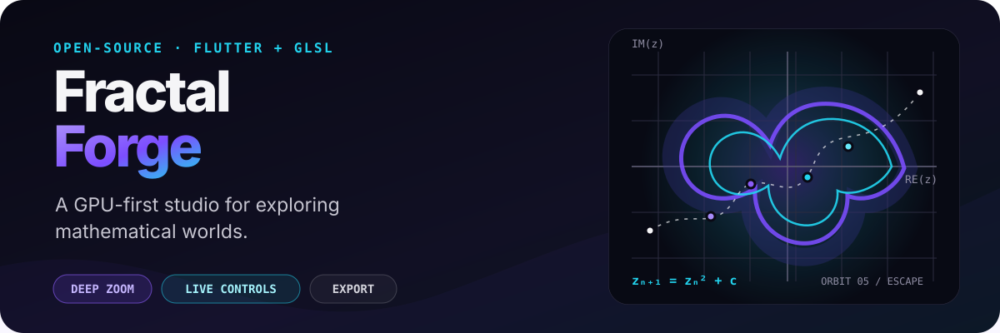
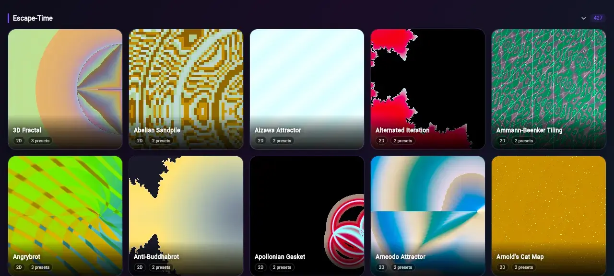
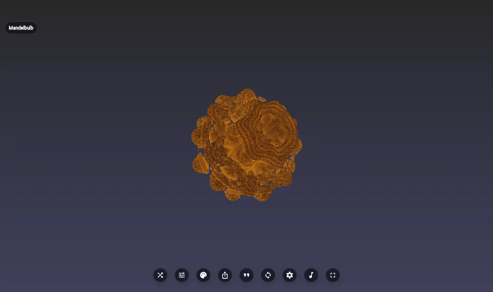
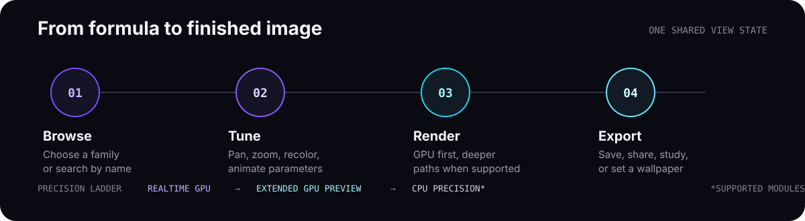

# Fractal Forge

<p align="center">
  
</p>

<p align="center">
  <a href="https://gitlab.com/TrebuchetDynamics/flutter-fractal-forge/-/pipelines"></a>
  <a href="https://flutter.dev"></a>
  <a href="https://dart.dev"></a>
  <a href="LICENSE"></a>
</p>

<p align="center">
  <strong><a href="https://fractal.trebuchetdynamics.com">Open the web preview</a></strong>
  &nbsp;·&nbsp;
  <strong><a href="https://play.google.com/store/apps/details?id=com.trebuchetdynamics.fractal.forge">Get the Android app</a></strong>
  &nbsp;·&nbsp;
  <a href="#run-it-locally">Build locally</a>
</p>

Fractal Forge is an open-source Flutter explorer for mathematical systems and generative art. Browse **1017 production fractals**, tune parameters in real time, move through deep-zoom render paths, and export the views worth keeping.

## See what it renders

<p align="center">
  <a href="https://fractal.trebuchetdynamics.com"></a>
</p>

<p align="center">
  <a href="https://fractal.trebuchetdynamics.com"></a>
</p>

> These static browser captures show the catalog and viewer, not full web/app parity. Export, sharing, CPU precision, and hardware GPU behavior are most complete in the installable app; see the [renderer backend matrix](docs/engineering/rendering/renderer_backend_matrix.md).

## What makes it useful

- **Explore a broad mathematical catalog** — move across escape-time formulas, root-finding basins, attractors, IFS, cellular systems, tilings, and ray-marched 3D forms.
- **Tune and render interactively** — GPU-first controls cover pan, zoom, presets, animation, 64 color schemes, and formula-specific parameters, with deeper preview and CPU paths where supported.
- **Keep the views worth keeping** — export images, share results, or set a render as wallpaper.
- **Use it on your terms** — [no ads, tracking, account requirement, or data collection](https://fractal.trebuchetdynamics.com/privacy-policy), with high contrast, reduced motion, screen-reader labels, and configurable touch targets.

Beyond the core workflow, experimental tools include dual Mandelbrot/Julia views, Fractal Music, and live Fourier analysis.

## Explore the catalog

| Family | Examples |
| --- | --- |
| Escape-time | Mandelbrot, Julia, Burning Ship, Tricorn, Celtic, Buffalo, Nova, Phoenix, Lyapunov |
| Root finding | Newton, Halley, Householder, Schroeder, Traub–Ostrowski, Noor Newton |
| Attractors | Clifford, Peter de Jong, Lorenz, Rössler, Aizawa, Dadras, Sprott, Svensson |
| IFS and geometry | Sierpiński, Koch, Barnsley Fern, Hilbert, Peano, Gosper, circle inversion |
| Cellular and number systems | Wolfram rules, Life-like families, Langton systems, Wireworld, Farey and Ulam views |
| Fractalish motion | Arachnid lattices, radial sigils, recursive arcana frames, aurora tides, keyframed metamorphosis |
| 3D and hypercomplex | Mandelbulb, Mandelbox, pseudo-Kleinian, quaternion Julia, KIFS, gyroid/Möbius/Cayley recursive objects |

The catalog counts stable renderable identities—not palettes, camera angles, presets, or thumbnails as separate fractals.

## From formula to image

<p align="center">
  
</p>

The renderer keeps exploration, history, export, wallpaper, looper, and audio tools on the same view state instead of forking the formula state for each feature.

### Precision ladder

| Tier | Method | Intended use |
| --- | --- | --- |
| 1 | Realtime GPU | Standard interactive pan, zoom, and parameter changes |
| 2 | Extended GPU preview | Deeper double-float or perturbation-backed preview for supported modules |
| 3 | CPU Precision | Slower exact-intended refinement for modules with a native CPU formula |

The ladder is capability-based. An unsupported module is not labeled “CPU Precision” merely because a synthetic fallback can draw something.

## Try it

### Browser preview

Open **[fractal.trebuchetdynamics.com](https://fractal.trebuchetdynamics.com)** in a modern WebGL 2.0 browser.

1. Pick a card from the catalog.
2. Drag to move; pinch or scroll to zoom.
3. Open controls to change iterations, palette, formula-specific parameters, or a preset.
4. Use the installable app when you need the fullest export, sharing, wallpaper, or precision behavior.

### Android

Install **[Fractal Forge from Google Play](https://play.google.com/store/apps/details?id=com.trebuchetdynamics.fractal.forge)** for the primary mobile experience.

## Run it locally

### Prerequisites

- Flutter SDK 3.x ([installation guide](https://docs.flutter.dev/get-started/install))
- Dart 3.x, included with Flutter
- A GPU or emulator with shader support: WebGL 2.0 for browsers, or compatible GPU drivers for installable targets

```bash
git clone https://github.com/TrebuchetDynamics/flutter-fractal-forge.git
cd flutter-fractal-forge
flutter pub get
flutter run -d chrome    # fastest preview; some app features are unavailable
```

For the fuller app feature set, choose an installable target:

```bash
flutter devices
flutter run -d linux     # or android, macos, windows, ios
```

Chrome is the quickest first render check; use Android or a desktop target when diagnosing platform-specific shaders, export, sharing, wallpaper, or precision behavior.

## Controls

| Gesture | 2D fractals | 3D fractals |
| --- | --- | --- |
| Drag | Pan | Rotate |
| Pinch / scroll | Zoom | Zoom |
| Double tap | Reset view | Reset view |
| Long press | Set the Julia seed in the dual viewer | Not used |

Common controls include iterations, bailout, power, color scheme, Julia seed, orbit traps, rendering technique, and family-specific coefficients.

## Platform support

| Platform | Status | Notes |
| --- | --- | --- |
| Android | Primary | Maintained Google Play build path |
| Web | Preview | JavaScript/WebGL 2.0; not full app parity |
| Linux, macOS, Windows | Development targets | Shader support depends on GPU and driver behavior |
| iOS | Build target | Requires Apple signing and Metal-backed Flutter rendering |

## Architecture

```text
main.dart
  └─ app shell + Provider services
      └─ HomeScreen
          ├─ CatalogRepository → ModuleRegistry → FractalModule
          └─ FractalViewerScreen
              ├─ GPU / extended preview / CPU precision renderers
              ├─ controls + presets + history + looper
              └─ export + wallpaper + share + Fractal Music
```

`ModuleRegistry` assembles the catalog from declarative configs, shared catalogs, custom builders, and debug-only diagnostics. Every viewer feature consumes the selected module and the same controller state.

For the directory structure, release builds, and shader contribution workflow, see the [`CONTRIBUTING.md`](CONTRIBUTING.md) guide.

## Testing

```bash
flutter analyze
flutter test
flutter test integration_test/   # requires a device or emulator
```

Useful focused lanes:

```bash
flutter test test/features/renderer/
flutter test test/catalog/
flutter test integration_test/flows/critical_journey_test.dart
```

Audit every production fractal in the real Linux renderer, with screenshots,
frame timings, and an HTML fix/review report:

```bash
python3 scripts/audit-linux-fractals.py
```

See the [Linux audit guide](docs/engineering/performance/LINUX_FRACTAL_AUDIT.md)
for headless runs, focused reruns, and GitLab artifacts. See
[`test/README.md`](test/README.md) for test conventions.

## Project references

- [Renderer backend matrix](docs/engineering/rendering/renderer_backend_matrix.md)
- [Performance notes](docs/engineering/performance/PERFORMANCE.md)
- [Shader optimization notes](docs/engineering/performance/SHADER_OPTIMIZATIONS.md)
- [Formula coverage limitation](docs/engineering/rendering/formula_coverage_limitation.md)
- [Launch ladder](docs/planning/LAUNCH_LADDER.md)
- [Contributing guide](CONTRIBUTING.md)
- [Security policy](SECURITY.md)
- [Changelog](CHANGELOG.md)

## Contributing

Contributions are welcome. Good first areas include thumbnail quality, presets, shader correctness, web-preview QA, accessibility checks, tests, and documentation. Read [`CONTRIBUTING.md`](CONTRIBUTING.md) before opening a pull request.

## License

Apache License 2.0. See [`LICENSE`](LICENSE).

## Acknowledgments

Built with [Flutter](https://flutter.dev). Shader and fractal techniques are informed by the wider mathematical visualization community, including the educational work of [Inigo Quilez](https://iquilezles.org/).
