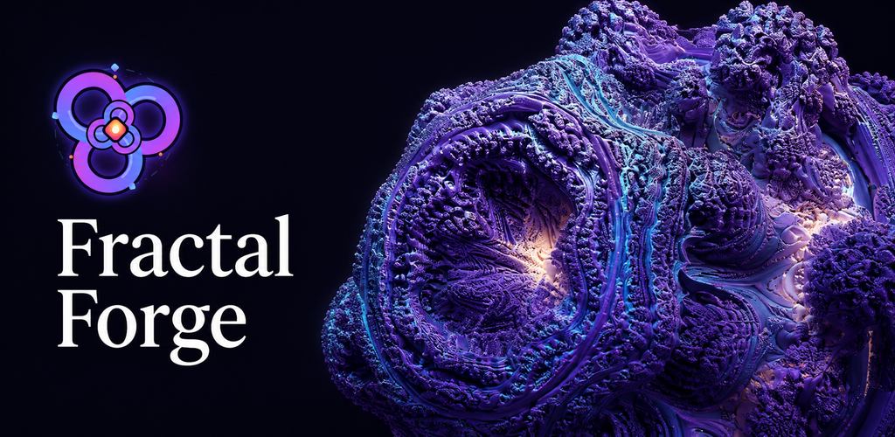
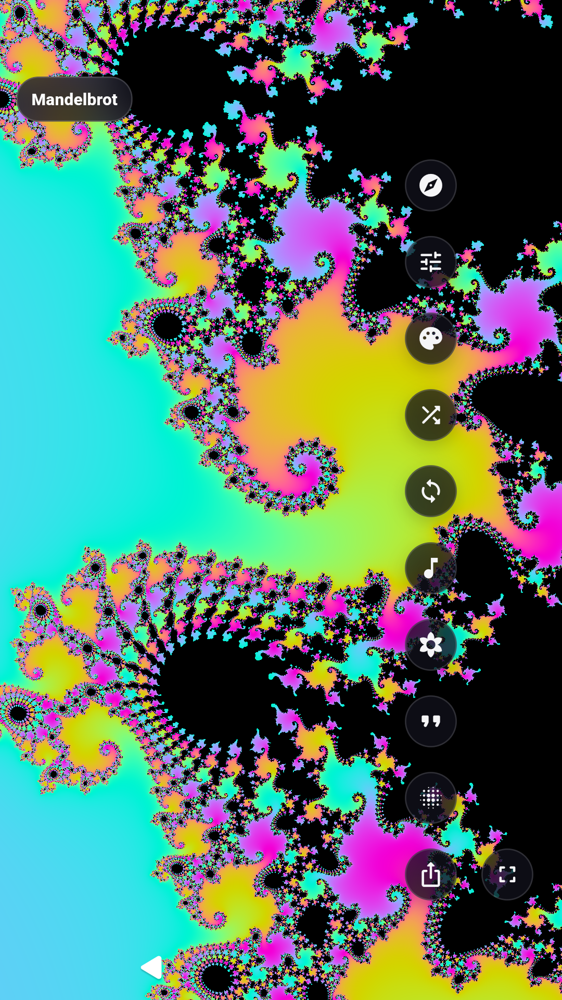
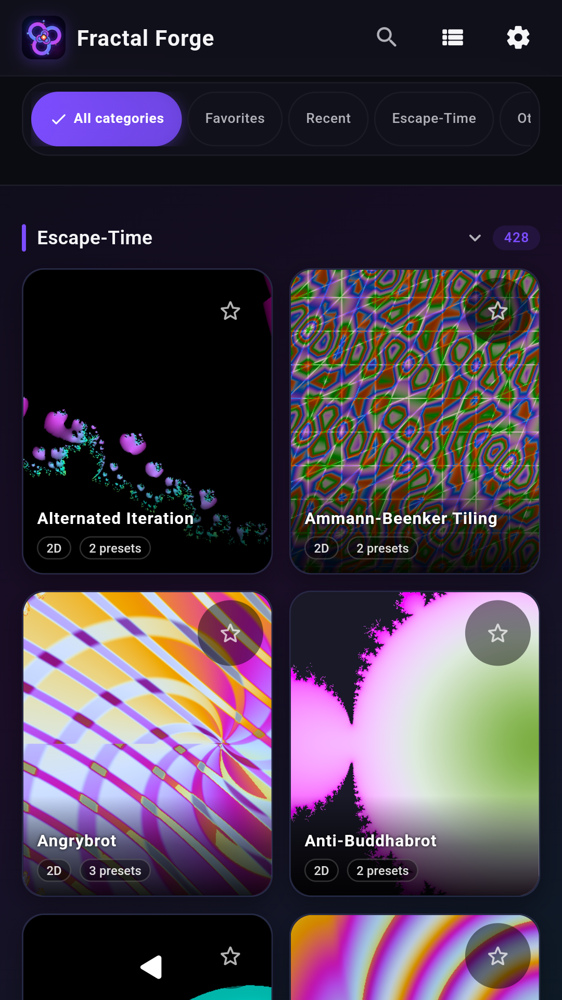
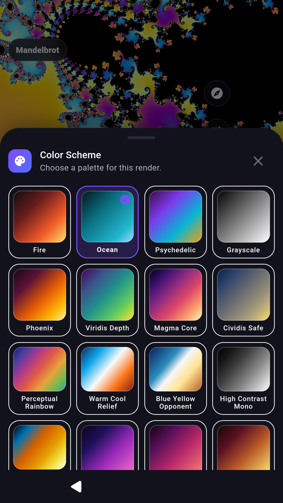
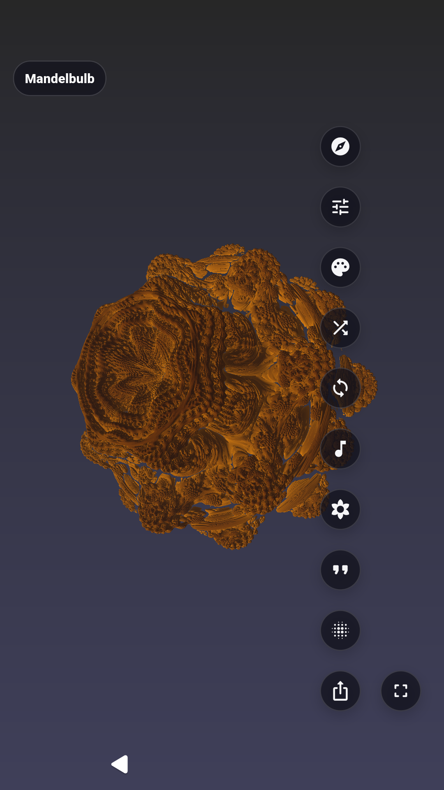
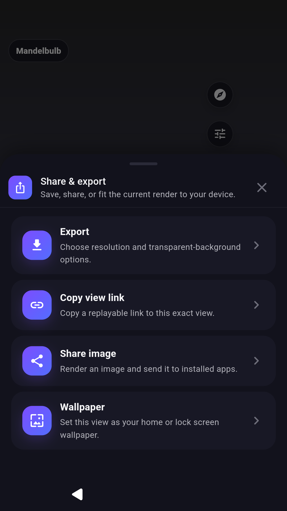
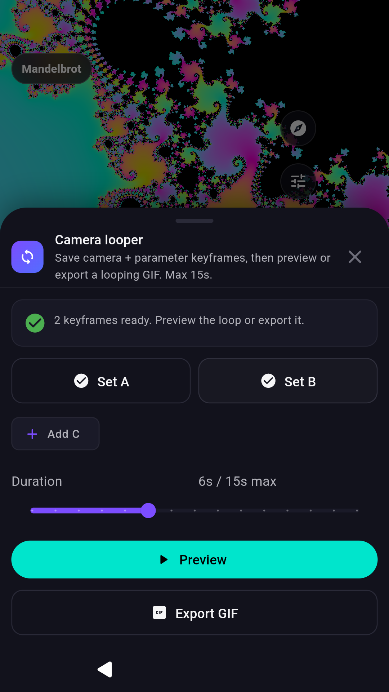

# Fractal Forge

Explore 1,000+ fractals. Make 4K wallpapers and animated art, all offline.

## Phone screenshot sequence

| Explore the detail | Find your next fractal | Make the colors yours |
|---|---|---|
|  |  |  |

| Explore 3D forms | Keep and share your art | Bring a view to life |
|---|---|---|
|  |  |  |

## Tablet screenshot sequence

[Catalog](screenshots/tablet/01-catalog.png) · [Exploration](screenshots/tablet/02-explore.png) · [Colors](screenshots/tablet/03-color.png) · [3D](screenshots/tablet/04-3d.png)

The captions here describe the screenshots for review and accessibility; they are not baked into the uploaded images. Google Play's image API does not accept these as image alt-text fields.

[Full English description](full_description.txt) · [All 15 translations](../play-store-localized-listings.json) · [Publishing and provenance](README.md)
